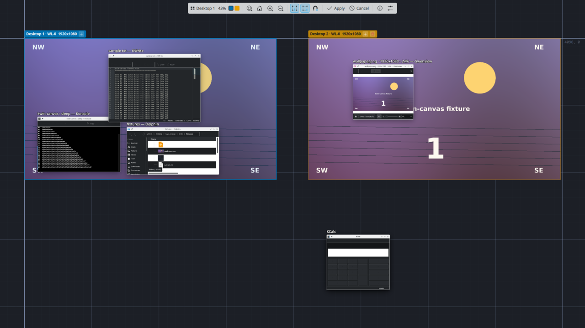

# kwin-canvas



An infinite canvas for KDE Plasma, built on KWin's public scripting API. No
patches, no forked compositor, no plugin against private headers.

Windows live on one unbounded plane, and there are two places to be on it.
A **location** is an activity's viewport onto the plane at 1:1 with the
canvas closed: stock Plasma, nothing of ours running, so games and
fullscreen apps get KWin's native path (direct scanout, no extra
composition). Every window is an ordinary KWin window at an ordinary
position, some of them off-screen, and KWin handles input, popups, XWayland
and focus exactly as it always does. The **overworld** is the open canvas:
every window drawn live on the plane, the ground, each activity as a group
of **monitor frames** (outlined rectangles, one per output in the layout KDE
knows, tagged with the activity and output names, its wallpaper inside) and
the toolbar. With the pass-through plugin loaded the windows in the
overworld are live too: the pointer over a window's client area goes to the
window and every key goes to the focused window.

One chord steps out and back in. Stepping out opens the overworld at the
current viewport at 1:1, so it looks like the desktop until you move.
Stepping in enters the location under the screen centre; if that is another
activity's frame you switch to it, and the viewport is written where the
camera is. Drag windows into a frame or drag an activity's frames over a
cluster of windows, step in, and that is what the real screens show in that
activity, written back as plain window geometry. Switching activities in a
location switches viewport, and dragging a window into another activity's
frame moves it to that activity. Virtual desktops stay what they are: the
canvas shows the current desktop's windows.

The ground plane is the reference for all of this. A grid with coordinate
labels scrolls under the windows when you pan at 1:1 and scales with them when
you zoom out, so the plane has landmarks and the zoom has something to anchor.

> Alpha. Tested in a nested KWin 6.7.5 session and on one live Plasma 6.7
> desktop.

## Parts

| Package | Type | What it does |
|---|---|---|
| `effect/` | KWin/Effect (QML) | The canvas: snapshot, ground, thumbnails, pan, zoom, pick, commit |
| `wallpaper/` | Plasma/Wallpaper | The ground at 1:1, offset by the last committed pan |
| `shared/Ground.qml` | copied into both | One renderer for the ground so both views match |
| `plugin/` | KWin plugin (C++, optional) | Pass-through: while the canvas is open, clicks, drags, the wheel and keys reach the real windows |
| `tools/kwin-canvas` | CLI (bash) | Step in, cancel, open or toggle from a terminal or a VT; status |
| `applet/` | Plasma/Applet | A panel button that fires the Toggle Canvas chord |
| `dev/nest.sh` | harness | Nested KWin with its own D-Bus and config, driven from the shell |

## Install

Full walkthrough in [docs/install.md](docs/install.md). On Arch, from the
[AUR](https://aur.archlinux.org/packages/kwin-canvas):

```bash
yay -S kwin-canvas      # or paru, or makepkg from the AUR clone
```

then enable **Canvas** in System Settings → Desktop Effects. The pass-through
plugin is its own package, `kwin-canvas-passthrough`, built against your
KWin; rebuild it after a KWin upgrade. From a release tarball with no
checkout:

```bash
kpackagetool6 --type KWin/Effect --install kwin-canvas-0.4.0.kwineffect.tar.gz
kpackagetool6 --type Plasma/Wallpaper --install kwin-canvas-ground-0.4.0.tar.gz
kpackagetool6 --type Plasma/Applet --install kwin-canvas-toggle-0.4.0.tar.gz
```

then enable **Canvas** in System Settings → Desktop Effects. From a checkout:

```bash
./configure.sh install      # the packages into ~/.local/share, the CLI into ~/.local/bin, effect turned on
./configure.sh status       # installed, enabled, loaded
./configure.sh uninstall    # off and removed
```

Every `configure.sh` command is one Makefile target (`make install enable`,
`make status`, `make uninstall`); `make` alone lists the rest, including
`install-system` with `DESTDIR` for distro packaging, `pkgbuild` for the
AUR skeletons, and `plugin` to build the pass-through plugin from a checkout.

Then pick **Canvas Ground** as the desktop wallpaper in Desktop Settings, and
disable the stock **Zoom** effect if it owns Meta+wheel.

## Use

| Key | At 1:1 (in a location) | Canvas open (the overworld) |
|---|---|---|
| Meta+Ctrl+Alt+Space | step out: the overworld opens at the current viewport, 1:1 | step in: enter the location under the screen centre; another activity's frame switches to that activity |
| Meta+Ctrl+Space | jump home | jump home |
| pan chords (no default; bind under Shortcuts → KWin) | slide the desktop half a screen that way | move the camera |
| three-finger touchpad swipe | the desktop follows the fingers, then settles half a screen that way | |
| drag on ground, Space+drag, or middle-drag | | pan |
| wheel over the ground | | zoom at the cursor |
| pointer over a window's client area | | the window's, with the plugin: click, drag, wheel, and a click raises |
| keys | | the focused window's, with the plugin; the canvas keys below apply without it |
| drag a window's title bar | | move it on the plane |
| drag a frame's tag or edge | | move that activity's frames, all together, and its windows with them so nothing changes on screen (`FramesCarryWindows`, on by default; off moves the frames over the windows) |
| drag a window's edge or corner | | resize it, live |
| eye on a frame tag | | hide or show that frame: a hidden frame is not drawn and takes no windows, for an activity that lives on one monitor |
| + on a frame tag | | add an activity |
| trash on a frame tag | | remove that activity (never the last) |
| click a window's title bar | | select it; Shift+click adds, Ctrl+click toggles, Shift+drag on the ground selects by rectangle |
| drag a selected window's title bar | | move the whole selection, geometry kept; drop it in a frame and step in to move them all to that activity |
| right-click a window's title bar | | arrange the selection: horizontally, vertically, tile, grid (rows × columns), cascade; send to an activity or to the plane |
| toolbar toggles | | snap to edges, corners, grid while dragging or resizing (grid step and snap distance are settings) |
| double-click a window's title bar | | enter that window's location; a window in another activity's frame takes you to that activity. With the `FocusTarget` setting at `window` (default) the point you clicked stays under the pointer at 1:1 and the frames move to make that so; at `desktop` a frame stays where it is and only a window outside every frame pulls its frame to it |
| double-click a frame | | enter that location, its activity current |
| Ctrl+double-click a frame, or click its swatch in the toolbar | | zoom to that activity |
| Shift+double-click a window outside every frame | | new activity centred on it, window moved there |
| Enter | | enter the location under the screen centre (the toolbar's **Enter**) |
| Esc | | back to where you were, nothing moved (the toolbar's **Cancel**); the window's own key when pass-through is live |
| Home | | look through the current activity's frames |
| 0 | | canvas origin |
| F / W | | zoom to fit |

Activating an off-screen window from the task manager pans the plane so it
comes on screen.

**Pass-through** is the optional binary plugin, `kwin-canvas-passthrough`,
and it is live whenever the canvas is open. The pointer over a window's
client area goes to that window, so clicks land, drags select or move
things inside it, the wheel scrolls it, and a click raises it; every key
goes to the focused window, Esc included. Title bars and edges, frames,
tags, the ground and the toolbar stay the canvas's: a drag on a title bar
moves the window on the plane, a drag on the ground pans, the wheel over
the ground zooms. Clicking a window's client area no longer selects it;
select from the title bar. The plugin is built against the installed KWin,
and KWin loads it only for that exact version; without it the overworld is
a navigation view and the canvas keys, Esc included, are its own. `make
plugin-status` says which. The `Passthrough` setting turns it off.

Panning in a location is a **slide**: the effect opens for a moment at 1:1
with no frames or toolbar, this activity's windows glide, and their new
positions are written once when it settles. No window changes activity, and
you never leave the location. The desktop's wallpaper rides along inside
its frame, and the ground shows beyond it. The step, the duration and the
swipe's finger count are settings. KWin's own three-finger swipes switch
virtual desktops and its four-finger swipes open Overview; a matching count
fires both, so pick a count you do not use elsewhere, or set it to 0.

When the chord does not reach the open canvas, `kwin-canvas exit` from a
terminal or a virtual terminal steps into the location under the screen
centre; `cancel`, `open`, `toggle` and `status` are the other subcommands.
It finds the session bus at the user's runtime directory, so it works from
a VT with no display. The **Canvas** panel applet (`applet/`) is a button
that fires the Toggle Canvas chord.

To start in the overworld at login there are two ways. The `AutoActivate`
effect setting opens the canvas as soon as the effect loads, at login and
when the effect is turned on in a live session. Or an autostart entry runs
`kwin-canvas open`, which waits up to ten seconds for KWin to load the
effect; see [docs/install.md](docs/install.md) for the file.

Translucent windows composite correctly in the overworld: a transparent
Konsole shows the ground and the windows behind it, since the thumbnails
carry alpha.

The canvas can also replace the Overview hot corner. It appears in System
Settings under Screen Edges, so any edge or corner can open it; pushing the
pointer in toggles it. In the nest the top-left corner is preconfigured.

Everything above is reassignable the KDE way:

- **Global chords** live in System Settings → Shortcuts → KWin: Toggle Canvas,
  Canvas Home, the pan chords (Canvas Pan Left, Right, Up, Down), and the
  in-canvas actions (Enter, Cancel, Fit, Origin, Zoom In, Zoom Out). Every
  Meta+arrow chord is taken by KWin, so the pan chords have no default until
  you give them one.
- **Effect settings** are in Desktop Effects → Canvas → configure: the opening
  view, the keys the open canvas listens for, the mouse gestures, pass-through,
  snapping, the activity colour scheme (including colour-blind safe sets),
  hidden frames, and the ground. They are entries in the `[Effect-kwin-canvas]`
  group of `kwinrc`.
- **Screen edges** are assigned on the Screen Edges page.

The toolbar inside the canvas sits on the primary display, at any edge or
corner (`HudPosition`), horizontal, vertical or square (`HudShape`, default
auto: square in a corner, vertical on a side, horizontal top or bottom). It
offers the same actions, a help panel built from the same entries, and a menu
into those settings pages.

## Develop

`make` alone lists every target. The important ones:

```bash
make deps             # check tools; make deps-install fetches what is missing
make play             # nest with the five fixture apps arranged and the canvas open
make nest             # the bare nest: KWin with the effect and plasmashell inside, own D-Bus bus
make nest-fixtures    # kcalc, kwrite, konsole, dolphin, gwenview on fixture files
make nest-cmd CMD=open           # drive the effect without a mouse
make nest-cmd CMD="zoom 0.4 960 540"
make nest-shot        # screenshot of the nest
make nest-reload      # reinstall, restart the nest, relaunch clients
make test             # scenarios against a dedicated test nest, with golden screenshots
make golden           # re-record the golden screenshots
make demo             # scripted session driven by real input; stills, frames, mp4 and gif in build/demo
```

The nest is a second `kwin_wayland` as a window of your session, with its own
D-Bus bus, config, activity manager (two activities seeded) and plasmashell,
so nothing touches the real desktop. `NEST_OUTPUTS=2` gives it two screens. Inside
it the canvas chords are Ctrl+Alt+Space and Ctrl+Alt+Home, because the outer
desktop sees Meta chords first. `build/tools/fakeinput` injects pointer and
keyboard events into it through KWin's fake-input protocol, which is how the
tests and the demo drive it.

See [docs/tour.md](docs/tour.md) for a tour in screenshots,
[docs/architecture.md](docs/architecture.md) for the model and the KWin API
facts this rests on, and [docs/testing.md](docs/testing.md) for the harness.

## Prior attempts

- **kwin-map** (March 2026): a KWin effect plus two source patches, aiming at
  live input while zoomed. Hit the effect API's limit on input routing.
- **hypr-canvas**: a Hyprland plugin with twelve function hooks. Worked, then
  broke across a Hyprland release when two hooked symbols disappeared.

Both wanted to interact with windows while the view was transformed. This
attempt drops that requirement from the effect: the location is stock KWin,
the overworld is navigation, and the effect lives entirely on the public
API. Interaction in the overworld is the optional plugin's job, through
KWin's exported plugin and input-filter interfaces.

## License

GPL-2.0-or-later, KDE's licence for effects and plugins, so this can be
contributed upstream without relicensing. `tools/protocols/fake-input.xml` is
KDE's fake-input protocol definition, LGPL-2.1-or-later. Full texts in
`LICENSES/`.
