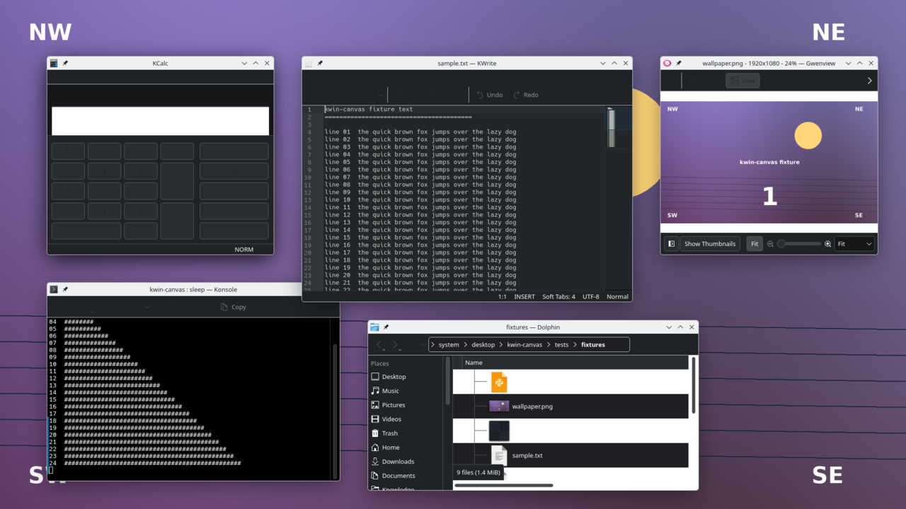
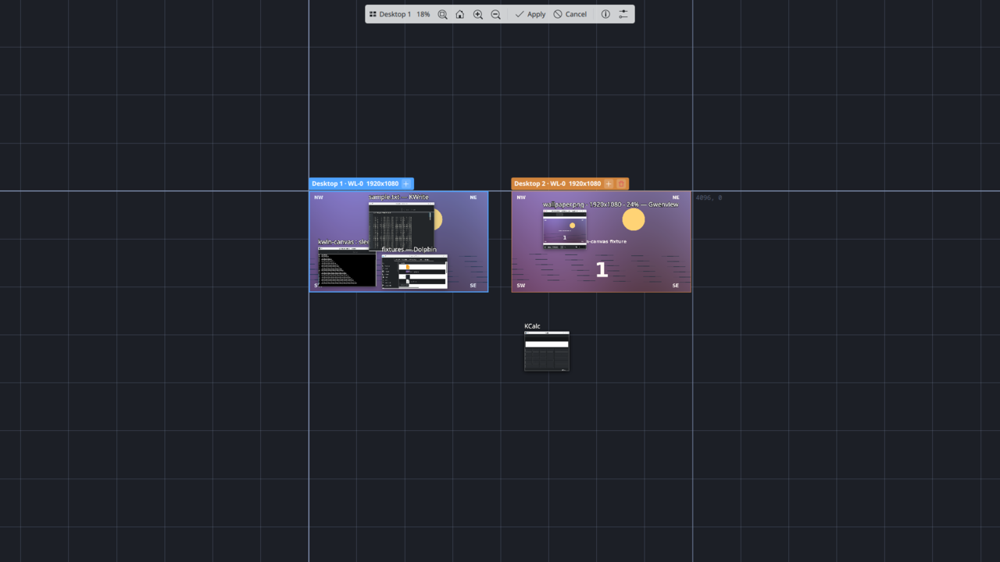
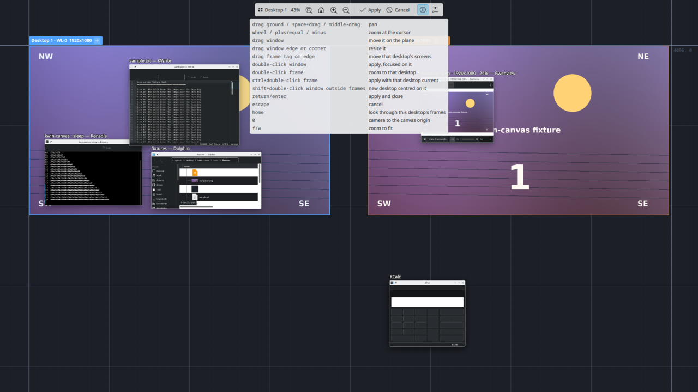
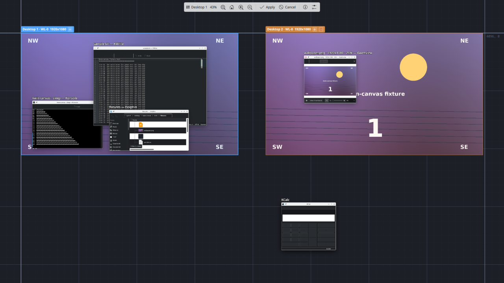
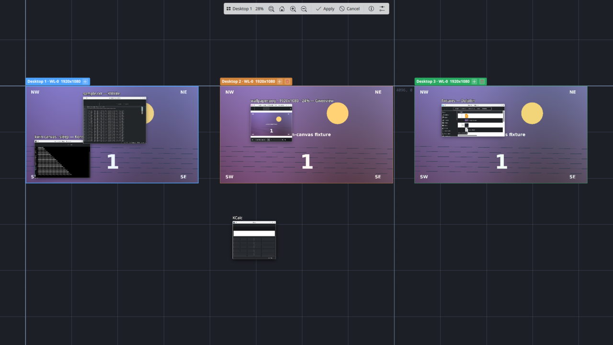
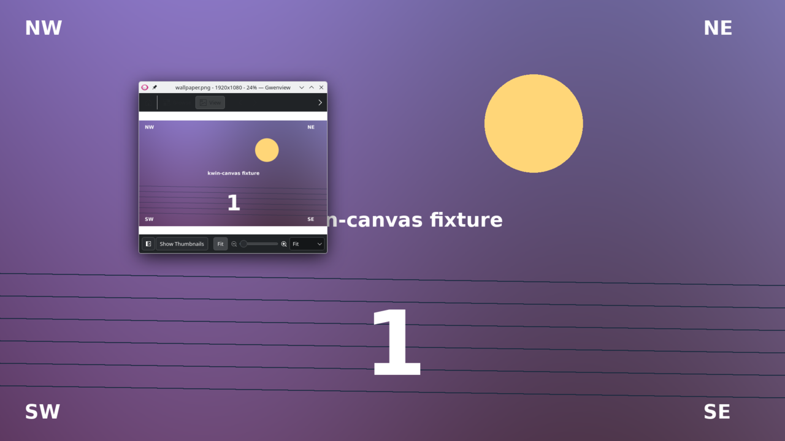
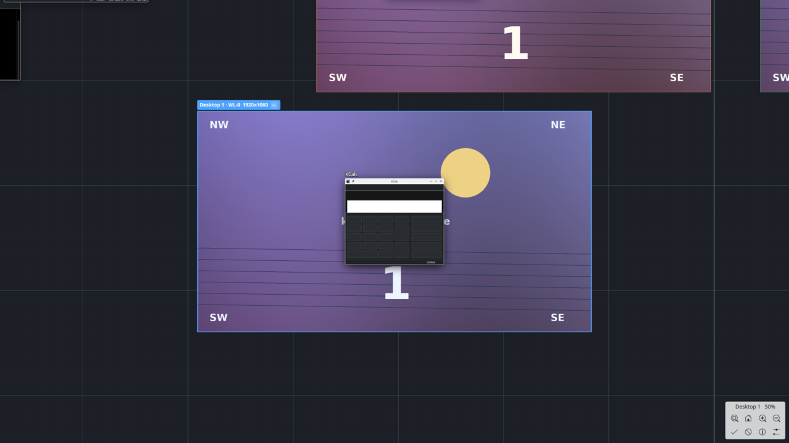

# A tour in screenshots

Every image here comes from `make tour`, which drives a nested KWin through
the same scenes each time and writes them to `docs/images`. Rerun it after a
visual change; the prose stays.

## The desktop at 1:1

Nothing is running. Plasma, your wallpaper, your windows. The canvas leaves
this state alone until you open it.

## Open

Meta+Space, or the hot corner. The canvas opens zoomed to fit everything:
the ground grid with its coordinate labels, one group of monitor frames per
virtual desktop showing that desktop's wallpaper, and every window as a live
thumbnail where it sits on the plane. Here Gwenview lives in Desktop 2 and
KCalc floats on the plane outside every frame. The toolbar on the primary
display shows the current desktop and zoom.

## Further out

Wheel out and the grid's coarser octaves fade in, so there is always a
legible spacing, and the labels give every region a name. The axes through
the origin are the one landmark that never repeats.

## Every control, from the config it runs on

The help button lists the bindings. They are read from the same settings the
actions use, so what it shows is what is bound. Change a key in the
configure dialog and the panel follows.

## Resize from the canvas

Drag a window's edge or corner and the real window is commanded to that
size on every step. The client answers with whatever it accepts, and the
thumbnail follows. KWrite here has just been told to be 1000 by 700.

## Desktops are frames on the plane

A third desktop, added from a frame tag's plus button, gets its frames laid
out beside the others. Drag any window into a frame and apply: it moves to
that desktop, at that spot. Dolphin is about to become a Desktop 3 window.

## Apply, then switch

After apply, switching to Desktop 2 at 1:1 shows exactly what its frame
held: Gwenview, where the frame had it.

## The toolbar goes where you want it

Any edge or corner of the primary display, horizontal, vertical, or square.
In a corner it defaults to square.

